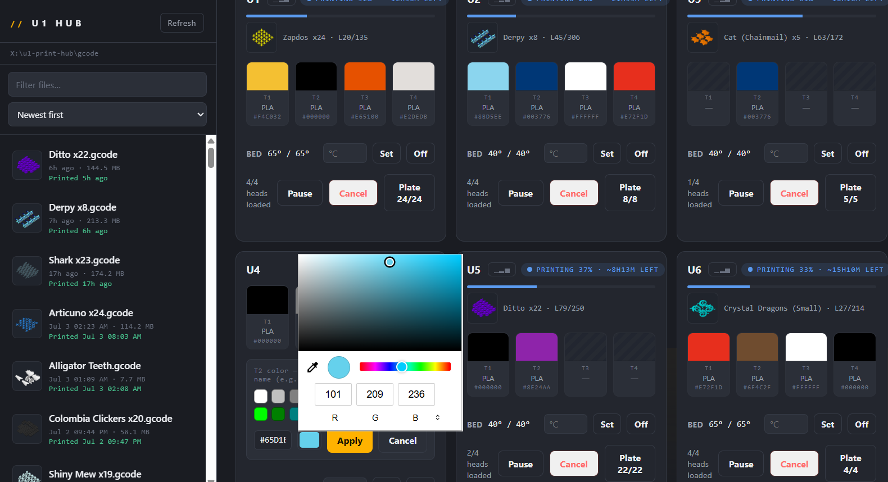
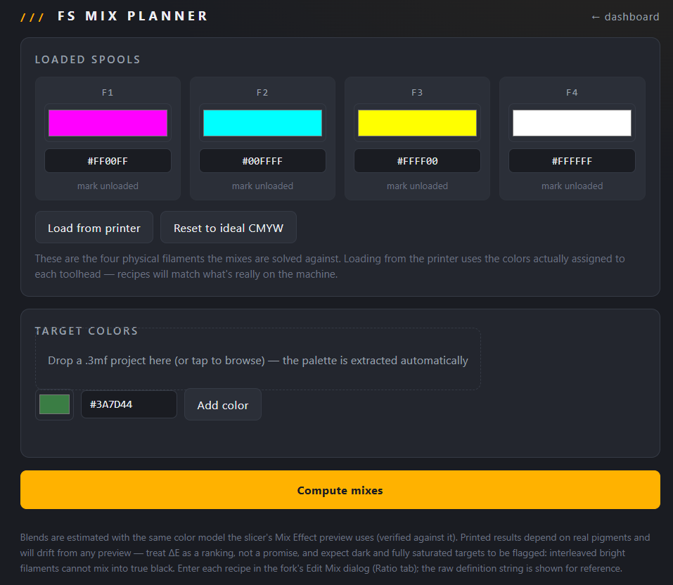

# U1 Print Hub



A small local dashboard for a farm of **Snapmaker U1** printers. From your phone or
any browser on the same network you can:

- Browse a folder of sliced G-code — with **embedded model thumbnails** — and see the
  **colors each job needs**.
- See **every machine's loaded colors and live status** at a glance, updated **in
  real time**: progress, screen-matching time remaining, and a **layer counter**
  tick the moment the printer reports them, not on a polling delay.
- **Change a loaded filament's color from the Hub** — tap a swatch on any idle machine
  and pick from common colors, type a hex code or a color name ("tan"), or open the
  full color picker. The touchscreen updates to match.
- **Push a job to any machine** — and optionally pre-map each color to the head you
  want it to print from, so the machine's mapping screen comes up already correct.
- Watch an **upload progress bar** while a file is sent, so a big push isn't a silent wait.
- **Pause, resume, or cancel** a running print from any card — and if a print errors,
  the card shows the **firmware's actual error message**, not just a red dot.
- **Skip a single object mid-print** from a tap-to-skip plate map — salvage the rest of a
  plate when one part fails instead of scrapping the whole bed.
- **Set the bed temperature** per machine, and get a warning chip when a printer's
  **storage runs low**.
- **Queue jobs "up next"** — build a shared print queue that survives Hub restarts,
  and reorder or remove entries with a tap.
- **Plan Full Spectrum mixes from any 3MF** — drop a multi-color project on the FS Mix
  Planner and get the exact filament blend recipes to print it on 4 toolheads, solved
  against the colors actually loaded on your machine.
- **Protect the Hub with a password** — optional single shared password with 30-day
  sessions, or hand auth to your reverse proxy (Authelia/Authentik supported).
- See **lifetime farm stats** (total jobs, print hours, filament used) and per-printer
  **temperature sparklines and job history** in expandable panels.

It talks straight to each printer's built-in Moonraker API. Nothing leaves your network.

---

## New in 2.6 — the access & mixing release

- **Print queue.** An **Up next** list lives above the file browser: tap **+ Add to
  queue** on any selected job, reorder or remove entries with a tap, and the queue
  persists through Hub restarts (`queue.json`).
- **FS Mix Planner** (🎨 in the top bar). Drop any multi-color 3MF — Bambu Studio and
  Orca-family projects both work — and the Hub extracts its palette, ranks colors by how
  many parts use them, and solves each one into the closest achievable blend of the
  filaments loaded on your printer. Every recipe comes with a ΔE quality grade, and
  colors that physically can't be mixed from your spools (true black, deep saturated
  tones) are **flagged as out of gamut instead of silently printing wrong** — the
  closest reachable match is shown so you know the tradeoff before wasting a print.
  Recipes are entered in your FS fork's Edit Mix dialog; the raw definition string is
  included for reference. The blend math was verified against the slicer's own Mix
  Effect preview.
- **Password protection.** The Hub now has an optional access gate: set a single shared
  password from ⚙ Settings → Manage access (or `/auth.html`) and every page and API
  call requires login, with sessions that last 30 days per device. Five wrong guesses
  locks the door for 15 minutes. Nothing changes until you opt in — existing installs
  stay open.
- **Reverse-proxy friendly.** Already running auth in front of the Hub? **Proxy mode**
  turns the built-in gate off on purpose, and **forward-auth mode** trusts the identity
  header your Authelia/Authentik setup injects — no double login.
- **Official spools handled honestly.** Snapmaker's RFID spools carry their color on
  the tag, and firmware refuses to override it — so the Hub no longer offers the color
  picker on official spools (hover the swatch to see why), and explains the lock in
  plain language instead of surfacing a firmware error.
- Quality of life: the browser tab finally has a favicon.



---

## New in 2.5 — the realtime release

- **Live dashboard.** The Hub now holds a websocket open to every printer and streams
  changes to your browser the moment they happen. Progress, ETA, layer counts, and
  state changes appear in well under a second. If a socket or the stream drops, the
  Hub falls back to classic polling automatically — it never gets worse, only faster.
- **Screen-matching progress and time remaining.** The Hub computes progress exactly
  the way the U1's touchscreen does (header-corrected byte progress), so the card and
  the screen finally agree — verified to within 1% and one minute on live prints.
- **Filament color control.** The Hub speaks the same firmware command the touchscreen
  uses (`SET_PRINT_FILAMENT_CONFIG`), then re-reads the printer to confirm the change
  landed before showing success. Guard rails match the touchscreen: idle printers and
  loaded slots only.
- **G-code thumbnails.** Snapmaker Orca embeds model previews in every sliced file;
  the Hub extracts them for the file browser and shows the active job's preview on
  each printing card.
- **Phone home-screen app.** Add the Hub to your phone's home screen for one-tap
  access. (Full standalone install activates automatically once the Hub is served
  over HTTPS — planned alongside remote access.)
- Quality of life: multi-color/gradient spool swatches (ready for RFID dual-color
  filament), "chamber" labeling, farm + per-printer statistics panels, active
  filename on cards, and a low-disk warning chip.

---

## Full Spectrum aware (since 2.0)

The U1's **Full Spectrum** workflow alternates a few physical filaments layer-by-layer to
produce many more apparent colors. The hub understands it:

- **Detects Full Spectrum files** from either fork family — ratdoux FullSpectrum and the
  Neotko feature pack — so it never mistakes a 16-color FS job for one that "needs more than
  the U1's 4 heads." (The Neotko build reports as stock Snapmaker Orca, so detection is by
  the file's config fingerprint, not the slicer name.)
- **Visualizes the mixed colors.** Select an FS job and the hub decodes its color recipes,
  showing every blended color with a preview swatch, the physical filaments it mixes, and the
  ratio — so you can see what your loaded filaments will actually produce. (The swatches are
  an on-screen approximation of the optical blend; the print is the final word.)

Plus, across every job: **last-printed date** for every file, **per-color filament
usage** (grams) on the selected job, cosmetic **T1–T4 head labels**, and a **scrolling
file list** that keeps the page tidy with big folders.

---

## Download (no Node.js needed)

Grab the build for your OS from the **[Releases](../../releases)** page, put it in
its own folder, and run it — a browser opens to the dashboard.

- **Windows** (`U1-Print-Hub-Windows-x64.exe`): SmartScreen may warn "unknown publisher"
  (the app isn't code-signed). Click **More info -> Run anyway**.
- **macOS** (`U1-Print-Hub-macOS-AppleSilicon` / `-Intel`): right-click -> **Open**
  the first time to clear Gatekeeper, or run `xattr -dr com.apple.quarantine <file>` once.
  You may need to `chmod +x` it.
- **Linux** (`U1-Print-Hub-Linux-x64`): `chmod +x` then run it.

`config.json` and a `gcode/` folder are created next to the executable on first run.
Use **Settings** in the page to add your printers.

> **Already running on port 4545?** Only one copy can use the port. If a launch flashes
> and closes, something else (often a second copy) already has 4545 — close it first.

---

## Run with Docker (Raspberry Pi / NAS / homelab)

For always-on hosts, run the hub in a container. It serves the same dashboard.

```bash
git clone https://github.com/dlgambill/u1hub.git
cd u1hub
cp config.example.json config.json     # a writable config the hub persists to
mkdir -p gcode                          # point your slicer here, or mount your real folder
docker compose up -d
```

Then open `http://<this-host-ip>:4545`.

**About auto-discovery:** the "Discover on network" scan only works with **host
networking**, which `docker-compose.yml` enables by default (Linux hosts). On Docker
Desktop (macOS/Windows) host networking behaves differently — comment out
`network_mode: host`, uncomment the `ports:` block, and just **add printers by IP** in
Settings (that always works, container or not).

Edit the `volumes` in `docker-compose.yml` to point at your real Orca output folder.

---

## Run from source (developers)

### 1. Install

You need **Node.js 22 or newer** (the realtime layer uses Node's built-in WebSocket
client) — get the **LTS** build from https://nodejs.org and run the installer
(defaults are fine). Then:

1. Unzip this folder somewhere permanent, e.g. `C:\u1-print-hub`.
2. Start it:
   - **Windows:** double-click **`start-windows.bat`**
   - **Mac / Linux:** run **`./start-mac-linux.sh`** in a terminal

The first launch installs what it needs (takes a minute) and then opens
**http://localhost:4545** in your browser.

> **Use it from your phone:** find the IP of the computer running the hub and open
> `http://THAT-IP:4545` on your phone — e.g. `http://192.168.1.20:4545`. Then use your
> browser's **Add to Home Screen** for a one-tap app icon. Keep the hub running on a
> computer that stays on (or set the launcher to run at startup).

### 2. First-time setup (all in the browser)

The **Settings** panel opens automatically the first time. Three steps:

1. **Add your printers.** Click **Discover on network** to scan your LAN and list any
   Snapmaker U1s it finds — click **Add** on each. (Or **Add manually** and type an IP.)
2. **Set your G-code folder.** Point it at the folder Snapmaker Orca saves sliced files to.
3. **Save.**

Reopen Settings anytime with the gear button.

---

## Using it

- **Pick a file** from the left to see the colors it needs. Files show a **thumbnail**
  and their **last-printed date** once they've run, and the selected job lists
  **per-color gram usage**. If it's a **Full Spectrum** job, a panel decodes and
  previews all its mixed colors and recipes.
- **Each machine card** shows its four heads (**T1–T4**) with the colors currently loaded,
  plus status and bed temp — and, while printing, a **live progress bar, layer counter,
  screen-matching time remaining, and the job's thumbnail**. When a job is selected, you
  get a per-color **"Send each color from"** picker (defaulted to the best match) and
  **Upload** / **Print** buttons.
- **Tap a head's color swatch** on an idle machine to change that filament's recorded
  color: pick from the grid, type a hex code or CSS color name, or open the full
  picker. The Hub confirms the printer accepted the change before showing success.
- **Press Print** to send to that machine; a progress bar tracks the upload, then the
  print starts with your color mapping already applied.
- **While a machine is printing,** the card shows **Pause / Resume** and **Cancel**, plus
  a **Plate** button that opens a live map of the bed. Tap any object to **skip** it — the
  rest of the plate keeps printing. (Skipping is irreversible.) The map's bottom edge is
  the **front** of the bed.
- The **▁▂▅ button** on each card opens live temperature sparklines, lifetime totals,
  and the last ten jobs. **Farm stats** at the bottom aggregates the whole fleet.

### Keep your printer IPs from changing

Open **Network inventory** at the bottom — it lists every machine's **MAC address**.
In your router, add a **DHCP reservation** binding each MAC to its current IP. After that,
addresses never move and you won't have to touch anything.

---

## Notes

- **Toolhead mapping** is set the same way Snapmaker Orca does it: the hub uploads the
  file, sends the `SET_PRINT_EXTRUDER_MAP` macros for your chosen head assignment, then
  starts the print. The dropdowns pick which physical head prints each color.
- **Per-head colors** are read from Moonraker's `print_task_config` object and written
  with the firmware's own `SET_PRINT_FILAMENT_CONFIG` command — the same one the
  touchscreen issues. The live plate map and skip feature use the standard Klipper
  `exclude_object` module.
- **Progress and time remaining** use the touchscreen's own formula: header-corrected
  byte progress from `virtual_sdcard` plus the slicer's estimated time, so the Hub and
  the machine's screen agree. Falls back to a self-correcting estimate when file
  metadata isn't available.
- **Realtime** uses one websocket per printer plus a server-sent-events stream to the
  browser; both fall back to plain HTTP polling automatically if anything is in the way.
- **Treat the hub like the printers it controls.** The Hub now ships with an optional
  password gate (⚙ Settings → Manage access) — turn it on if anyone you don't fully
  trust can reach your network. One honest limit remains: the Hub still serves plain
  HTTP, so **don't expose it to the internet or forward a port to it** — a password
  sent over unencrypted HTTP is only as private as the network it crosses. LAN use
  with the gate on is the sweet spot today; hub-managed secure remote access (HTTPS
  via tunnel) is the next release, and it's what will make remote use safe.

---

## Found this useful?

**Buy me a beer** -> https://venmo.com/u/dgambill  (Venmo @dgambill). No pressure, all appreciated.

## License

MIT — see `LICENSE`. Free to use, change, and share.

---

## Diagnostic: capture how Orca sends the toolhead mapping

`capture-proxy.js` sits between Snapmaker Orca and ONE real printer, forwards
everything (so Orca works normally), and logs every request — so you can see the
exact call that carries the head mapping.

1. Find the IP of the machine running this (Windows: `ipconfig`; Mac/Linux: `ifconfig`).
2. Run, pointing at the printer you're testing:
   `node capture-proxy.js http://<printer-ip> 7125`
3. In Orca, edit that printer's connection host to `http://<this-machine-ip>:7125`
   (keep type = Klipper/Moonraker). Slice, set your toolhead mapping, hit Send.
4. Everything lands in `capture-<timestamp>.log` — the upload and any mapping call
   will be in there in plain text.
5. When done, point Orca's host back at the real printer IP.

---

## For maintainers: building & releasing

Single-file executables are built by [`@yao-pkg/pkg`](https://github.com/yao-pkg/pkg)
on **native runners** (each OS builds on its own runner — no cross-compiling). To cut a
release, bump the version in `package.json` and the `VERSION` constants in `server.js`
and `public/index.html`, then tag and push:

```
git tag v2.6.0
git push origin v2.6.0
```

`.github/workflows/release.yml` builds Linux, Windows, and Apple-Silicon macOS binaries
and publishes them to a GitHub Release. The Intel-Mac build is a **best-effort** job:
GitHub's free `macos-13` runners are often unavailable, so it must not block the release —
it attaches its binary afterward if/when a runner frees up. To build locally instead:
`npm install && npm run build` (output in `dist/`).
