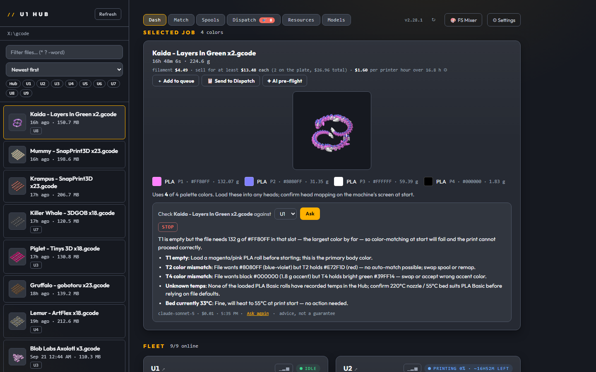
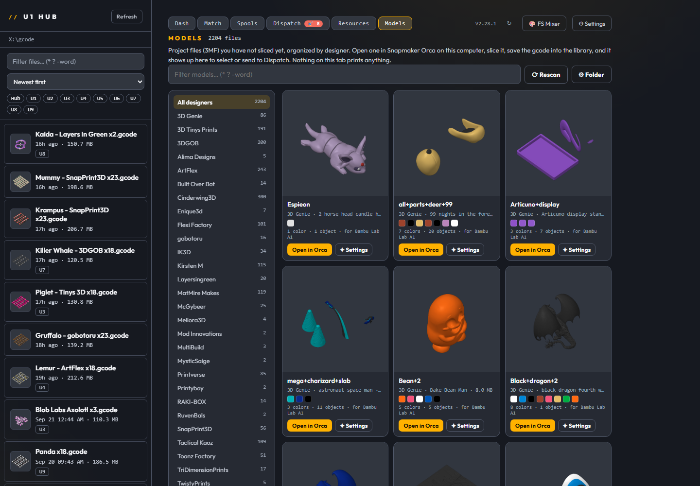
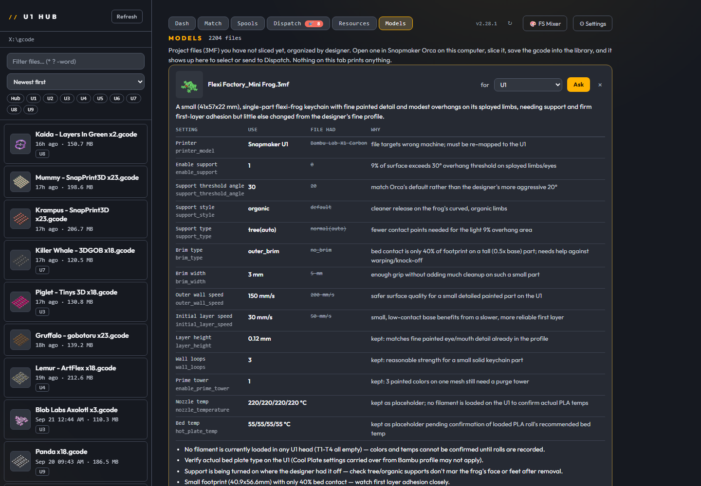
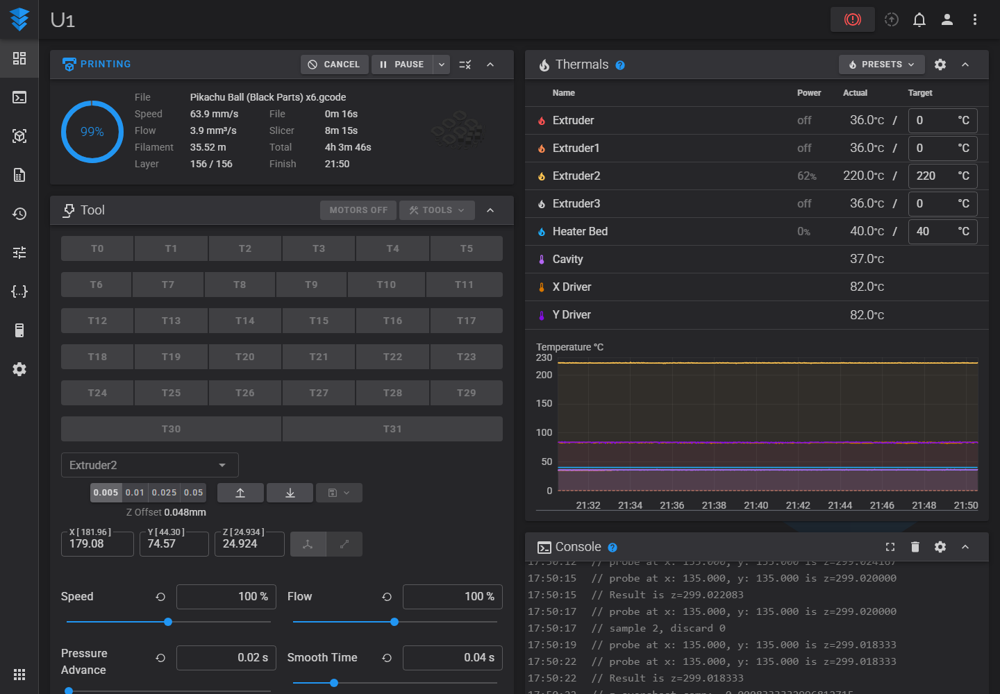

# U1 Print Hub

One dashboard for a whole farm of Snapmaker U1 printers. Other Klipper printers
can join in too (that part is in beta).


You run the Hub on a computer that stays on. Your phone, or any browser, opens
it like a web page. From there you can see every machine at once, send prints,
watch cameras, plan your printing week, know what filament to buy before you
run out, and - new in 2.28 - ask what settings a model wants before you slice
it, and whether a plate is worth printing at all.

Nothing gets installed on the printers. The Hub talks to the software they
already run, and nothing leaves your network unless you turn remote access on,
ask for a phone notification, or press one of the two AI buttons with your
own key in place.

---

## What it does

**See the whole farm at a glance.** Every printer gets a card with its live
status, progress, loaded colors, camera, and bed temperature. A print that
paused or failed says why, in the firmware's own words, so you know whether to
walk over. A printer that is down for maintenance says so right on the card,
and the scheduler routes work around it until you bring it back.

**Send prints without walking over.** Pick a file, see the colors it needs,
choose which head prints which color, and push it to any idle machine. Files
live in one merged list: the Hub's library plus whatever is stored on each
printer, with thumbnails.

**Know whether it is worth printing.** Under every file you select, one line
says what its filament costs, the least it has to sell for (per piece when the
file name carries the plate count, like `Penguin x20.gcode`), and what that
comes to per printer hour. Type what a piece really sells for in the box
beside it and you get the real numbers: what the plate brings in, dollars per
printer hour, dollars per gram, margin over filament. Save it, and the table
link lists every file you have priced, most profitable per printer hour
first, so you can see which models carry the farm and which just keep it
busy. The two rates behind the floor - your sell floor per gram and what
filament costs you per gram - are in Settings. The Hub never decides anything
from this; it is the number to look at before you queue a plate.

**Get a second pair of eyes before you press print.** With your own Anthropic
API key in Settings, the AI pre-flight button on the job card has Claude read
the settings baked into the sliced file and compare them with what is actually
loaded in the printer you picked: wrong material or temperature for a head, an
empty head a color needs, a missing prime tower, bed temperature wrong for the
plate. You get GO, CHECK or STOP and the reasons, most important first.



**Browse the models you have not sliced yet.** The Models tab reads a folder
of 3MF project files (Designer\Model\file.3mf, the way designers ship them)
and shows each one with the plate render saved inside it, the colors it was
painted with, and the objects on the plate. Open in Orca launches it in
Snapmaker Orca on the Hub computer; when you save the gcode, the Hub notices
and offers to select it or send it to Dispatch.



**Ask what settings a model wants.** The Settings button on any Models card
has Claude suggest the slicer settings for that file on the printer you pick,
before you slice - a table of setting, the value to use, what the designer's
profile had, and why. It is specific to the model because of what goes with
the question: the plate picture from inside the file, numbers the Hub measures
from the actual meshes (size, how much of the surface overhangs, undersides
that float, how much touches the bed, painted faces, volume), the designer's
own project settings, and what is loaded in your printer. It maps the
project's colors to your loaded heads when it can, and lists what to watch.



**Plan your whole printing day.** The Dispatch tab schedules your queue across
every printer, inside the hours you are actually home to swap plates. It flags
jobs that want the same spool at the same time, lets you push a job back a
place, and adopts prints that are already running.


**Know what to buy.** The Resources tab reads every scheduled file, adds up
the filament by color, compares it to the spools you own, and shows what you
are short. Every row gets a Replenish on Amazon button that searches for that
exact filament.


**Give every spool an identity.** Scan a spool's RFID tag with your phone, or
print a QR label for rolls that have no tag. The Hub remembers the brand,
color, and temps, tracks which machine each spool is loaded in, and tracks
grams left and price per roll. When a print finishes, the grams each head used
come off the roll that was in it, with the cost of that print at the price you
paid, and an Undo if it got one wrong. Already keep your rolls in
[Spoolman](https://github.com/Donkie/Spoolman)? Import them in one click; the
Hub reads Spoolman and never writes to it.


**Ask "what can I print right now?"** The Match tab reads the colors loaded
on each printer and lists the library files those colors can already produce,
best match first, one tap from printing.


**Let your phone tell you.** Settings can send push notifications through
[ntfy](https://ntfy.sh) (free, no account) when a print finishes, a printer
pauses (with the reason), errors, or stops answering. Pick the events you want;
one box turns it all off.

**Open any printer's own control page in one click.** Click a printer's name
and its full Klipper interface (Fluidd) opens, no typing IP addresses. On your
network it opens the printer directly, so its live data and controls work
exactly as they do when you visit the printer on its own.



**Use it from your phone.** The whole thing is built for a phone screen. Add
it to your home screen and it behaves like an app. (The Models tab and its
Open in Orca button are desktop only, because they open a program on the Hub
computer.)


There is more in the drawers: smart plug power control with a guard that
refuses to cut power mid-print, a Full Spectrum mix planner, per-printer
stats and temperature graphs, skip-an-object mid-print, a shared print queue,
and printable QR spool labels. The [long version](docs/CHANGELOG.md) covers
everything in detail, release by release.

---

## Getting started

**There is no phone app to install.** The Hub runs on a computer (Windows,
Mac, or Linux) that stays on. Your phone just opens it in a browser.

**Easiest: download a build.** Grab the one for your system from the
[Releases](../../releases) page, put it in its own folder, and run it. A
browser opens to the dashboard, and Settings walks you through adding your
printers.

A few first-run notes:

- Windows may warn about an unknown publisher. Click More info, then Run anyway.
- On a Mac, right-click the file and choose Open the first time.
- On Linux, `chmod +x` the file, then run it.
- Only one copy can run at a time. If it flashes and closes, another copy
  already has port 4545.

**From your phone:** open `http://THE-COMPUTER'S-IP:4545`, then use your
browser's Add to Home Screen.

**Docker, for a Pi or NAS:**

```bash
git clone https://github.com/dlgambill/u1hub.git
cd u1hub
mkdir -p data gcode
docker compose up -d
```

Everything the Hub remembers (printers, password, tunnel, spools, schedule)
lives in `./data` on the host, so upgrading is `git pull` and
`docker compose up -d --build` with nothing to redo. If you set up with the
older compose file, which only kept `config.json`, move that `config.json`
into `./data`, and copy your old container's `spools.json`, `slots.json`,
`dispatch.json`, `auth.json` and `tunnel.json` in beside it once
(`docker cp u1-print-hub:/app/spools.json data/` and so on).

**From source:** install Node.js 22 or newer, then run `start-windows.bat` or
`./start-mac-linux.sh`. First launch installs what it needs and opens the page.

**To turn on the AI buttons:** make a key at
[platform.claude.com](https://platform.claude.com/) (API keys, Create key; it
starts with `sk-ant-`), add a few dollars of credit there, and paste it into
Settings under AI pre-flight. The key stays in `config.json` on the Hub
computer and is never shown again. Both buttons are off until a key is in.

---

## Using it away from home

Two switches in the Hub, no router changes:

1. Set a password (Settings). The Hub refuses to go public without one.
2. Turn on the tunnel (Settings). The Hub sets up a free Cloudflare tunnel
   and gives you an HTTPS address that works from anywhere.

Everything the Hub itself shows works remotely this way: the fleet, sending
prints, cameras, spools, and scheduling. The printers' own Klipper pages are
best used on your own network; opening them from outside can depend on your
network setup.

---

## The honest fine print

**The AI buttons send data out, and only when you press them.** For a gcode:
a text brief of a few thousand characters - the file name, the slicer
settings Orca wrote into it, the filaments it was sliced for, the object
count, and what the Hub has recorded in that printer's heads. For a 3MF: the
measured numbers, the designer's settings, the loadout, and the small plate
picture from inside the file. Never the gcode or the meshes themselves, never
your printers' addresses. Settings has a link that shows you the exact brief
for any file before you trust it with a key. A pre-flight costs about a cent
on Claude Sonnet, a settings suggestion a few cents (the model thinks first),
and the same file against the same loadout is answered from a local cache for
free.

**Amazon links.** The Replenish on Amazon buttons carry an affiliate tag, so
the creator of this software earns a small commission if you buy through one,
at no extra cost to you. This is disclosed on the page itself, and there is a
checkbox in Settings to turn it off. Off means off: the links still work, they
just carry no tag.

**Update checks.** Once a day the Hub fetches one small public file to see if
a newer version exists. It sends nothing about you or your setup. One checkbox
turns it off, and off means no request is made at all.

**In-app slicing is not ready.** The checkbox for it ships off, and turning it
on warns you first. If you would like to help finish it, fork away.

**Other printer brands are beta.** The printer types feature works against
stock Klipper and Moonraker in testing. If yours misbehaves, use Download
diagnostics in Settings and attach the file to a
[GitHub issue](https://github.com/dlgambill/u1hub/issues/new/choose).

---

## Problems?

Open Settings, click Download diagnostics, and attach the file to a
[GitHub issue](https://github.com/dlgambill/u1hub/issues/new/choose). The file
is yours to review before you send it.

## License

MIT. See `LICENSE`. Free to use, change, and share.
