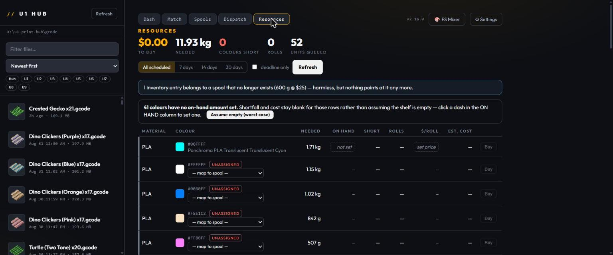
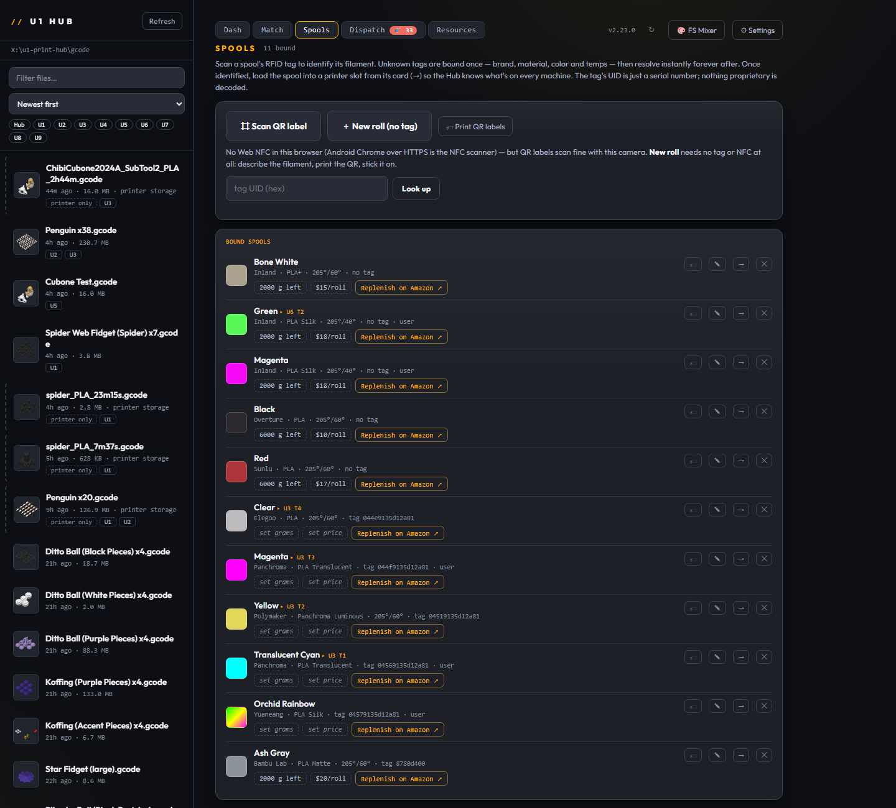
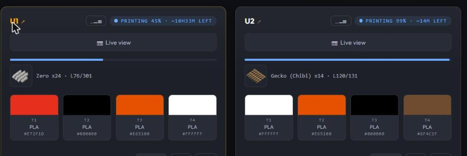
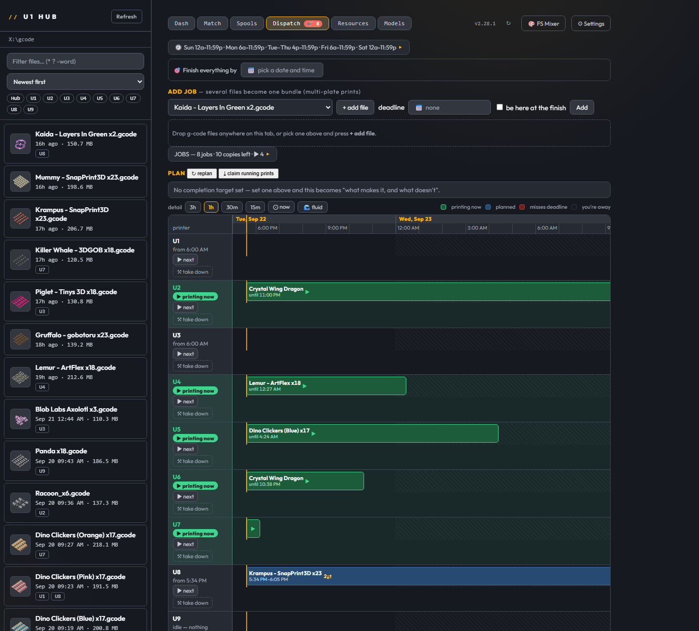
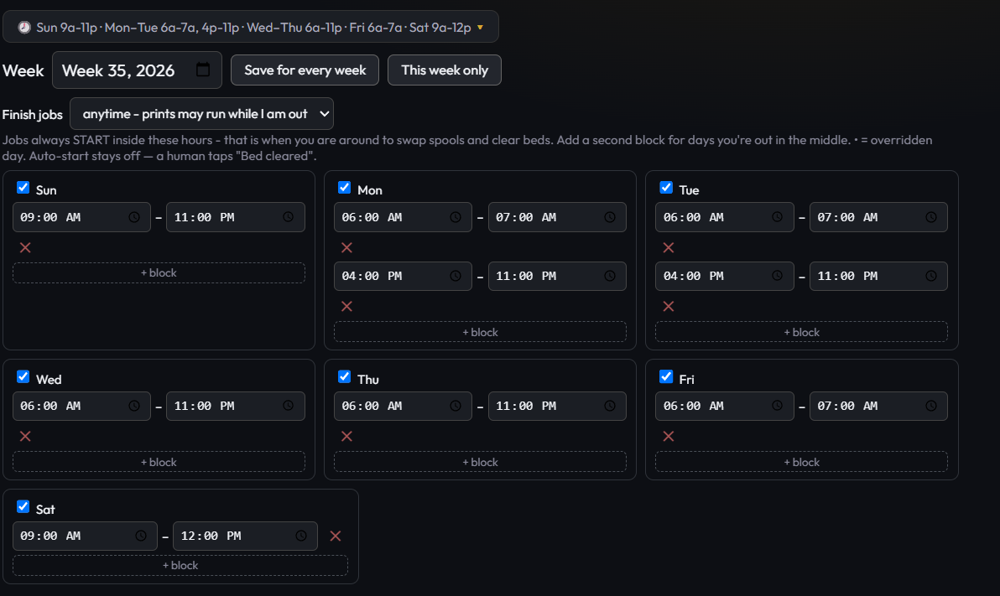
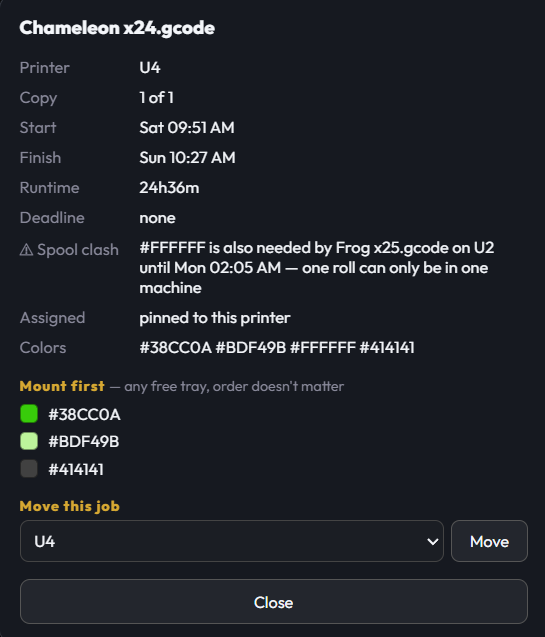
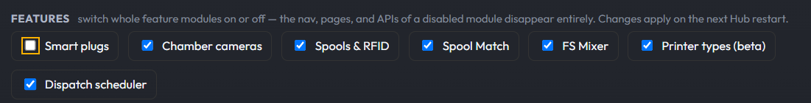

# U1 Print Hub, the long version
This is the old long-form README, kept because its release notes explain every feature in depth. The short version lives in the repo root.

# U1 Print Hub


A small local dashboard for a farm of **Snapmaker U1** printers — and, in **beta**,
any other Klipper/Moonraker printer you run beside them. From your phone or
any browser — on your network, or **securely from anywhere** — you can:

- Browse **every G-code file you have, wherever it lives** — the Hub's own library and
  each printer's onboard storage, merged into **one list** with badges showing which
  machines hold a copy, **embedded model thumbnails**, and the **colors each job needs**.
- **Manage files where they sit**: rename or delete in the Hub library or on any
  printer's storage, and **copy files printer-to-printer** with live progress and a
  size-verified result — no re-slicing, no USB sticks.
- See **every machine's loaded colors and live status** at a glance, updated **in
  real time**: progress, screen-matching time remaining, and a **layer counter**
  tick the moment the printer reports them, not on a polling delay.
- **Peek inside any machine** — open its **chamber camera** as an on-demand live view
  from the card, and close it again to keep data use down.
- **Change a loaded filament's color from the Hub** — tap a swatch on any idle machine
  and pick from common colors, type a hex code or a color name ("tan"), or open the
  full color picker. The touchscreen updates to match.
- **Push a job to any machine** — and optionally pre-map each color to the head you
  want it to print from, so the machine's mapping screen comes up already correct.
- **Ask "what can I print right now?"** — **Spool Match** reads each printer's loaded
  colors and lists the library jobs those colors can already produce, best match first,
  one tap from printing.
- Watch an **upload progress bar** while a file is sent, so a big push isn't a silent wait.
- **Pause, resume, or cancel** a running print from any card — and if a print errors,
  the card shows the **firmware's actual error message**, not just a red dot.
- **Skip a single object mid-print** from a tap-to-skip plate map — salvage the rest of a
  plate when one part fails instead of scrapping the whole bed.
- **Set the bed temperature** per machine, and get a warning chip when a printer's
  **storage runs low**.
- **Power a printer on or off** through a smart plug — with live wattage on metered
  plugs, and a guard that refuses to cut power to a machine that's mid-print.
- **Queue jobs "up next"** — build a shared print queue that survives Hub restarts,
  and reorder or remove entries with a tap.
- **Plan your whole printing day** — **Dispatch** schedules jobs across every printer
  against the hours you're actually home, adopts prints already running, flags spool
  conflicts, and hands each start back to you for a bed-clear confirmation.
- **Plan Full Spectrum mixes from any 3MF** — drop a multi-color project on the FS Mix
  Planner and get the exact filament blend recipes to print it on 4 toolheads, solved
  against the colors actually loaded on your machine — or ask it **which 4 spools from
  your shelf** to load in the first place.
- **Give every spool an identity** — scan a spool's **RFID tag with your phone** (or a
  printed **QR label**) and the Hub knows its brand, material, color — even dual-color
  silks and gradients — and temps forever after. Scan again to **load it into a printer
  slot in one motion**, head color set to match. **Print the labels themselves from
  your phone** straight to a Bluetooth label printer — no companion app needed.
- **Reload a past print's exact filaments** — the Hub remembers which spools every
  finished job used and offers them back next time you pick that file, with an honest,
  printer-verified apply.
- **Track what's loaded where** — every bound spool shows which machine and slot it's
  physically sitting in, fleet-wide.
- **Protect the Hub with a password** — optional single shared password with 30-day
  sessions, or hand auth to your reverse proxy (Authelia/Authentik supported).
- **Reach it from outside your network** — the Hub can run a Cloudflare tunnel for you:
  HTTPS end to end, no port forwarding, no router changes, and it **refuses to go
  public until the password gate is on**.
- **Know what to buy before you run out** — **Resources** reads the G-code for every
  scheduled job, totals the filament by material and colour, matches it against your
  spools, and lists what's short and what it costs. Track grams left, price per roll
  and a buy link on each spool; a colour with no spool stays **unassigned** rather
  than being guessed at.
- **Label a disposable roll with no RFID tag** — describe the filament, print the QR,
  stick it on. The label *is* the tag.
- **Jump to a printer's own Klipper interface** by clicking its name on the card.
- See **lifetime farm stats** (total jobs, print hours, filament used) and per-printer
  **temperature sparklines and job history** in expandable panels.

It talks straight to each printer's built-in Moonraker API. Nothing is installed on the
printers, and nothing leaves your network unless you turn remote access on.

---

## New in 2.33 - sort the shelf

A sort box on the Models tab, next to the filter: Designer A-Z (the order
it always had), Name A-Z, Newest first, Oldest first, Most printed, and
Random. The choice is remembered in the browser. Newest and oldest go by
the file's own date, which for a download is the day it landed. Random
deals one shuffle and keeps it: Show more pages through the same order
without repeating a card, and a Shuffle button deals a new one.

Most printed is the one that took work, because nothing on the shelf has
been printed - what gets printed is the gcode sliced from it. The Hub asks
every printer for its own job history (Moonraker keeps it on the printer),
counts the completed jobs by file name, and matches them to the 3MFs two
ways. If the Hub watched Orca save the gcode, from the Open in Orca button,
it recorded which file it came from, and that link wins; it moves with a
Rename and goes with a Delete. Otherwise it goes by the name: a gcode
called `Penguin x20` is the Penguin; `donut_PLA_2h13m` (Orca's default
name) is the donut; a designer's name or a collection folder's name in
either is ignored; plurals and a qualifier in parentheses are forgiven
("Crystal Dragons (Small)" is the Crystal Dragon). What it will not do is
guess: a one-word name only matches exactly (Turtle is not Sea Turtle, and
"Assembly", Orca's name for an unnamed plate, is not every model whose
folder mentions assembly), and the foot of the list says how many
completed jobs found a file here and how many printers answered, so a
number you see is one you can trust and the rest is honestly unmatched.
Each card in that order says how many times. The printers' histories are
asked once every ten minutes, in parallel, and a printer that is off for
the night still counts what it printed from the last answer it gave.

### 2.30.2 - the phone, uncut

Since 2.29 the dashboard on a phone could be wider than the screen: the
printer cards ran off the right edge and nothing scrolled or pinched to
reach them. The price readout on the job card was one line that refused
to wrap, the main column is a grid item that grows to fit its widest
unbreakable thing, and the phone layout clips the overflow - so the page
was 700px wide on a 390px phone with the extra simply cut off. The readout
wraps now, and the column, the cards and every module inside it are
allowed to shrink below their content, so the next stray nowrap anyone
adds spills over its own line instead of resizing the page. Checked in a
390px frame: page 377px wide, every card inside it.

### 2.30.1 - the table as a file

An Export CSV button on the "What sells" table. Same rows, same order as
the screen, one line per priced file with every number the Hub worked out
(pieces, price, plate revenue, hours, dollars per printer hour and per gram,
filament cost, margin, the floor it was judged against, and when you saved
it). Opens straight into Excel or Sheets.

## New in 2.30 - tidy the shelf from the shelf

Three more buttons on every Models card, under Open in Orca and Settings.

**Rename** moves the file to where the convention says it lives:
`Designer\Name\Designer - Name.3mf`. The designer and name come from the
folders the file already sits in (a designer's download in
`3D Genie\donut keyring\Donut+man+painted.3mf` becomes
`3D Genie\donut keyring\3D Genie - donut keyring.3mf`), or from what you
typed under Attributes, which wins. It shows you the target and asks once;
it never renames over an existing file; the card, the designer rail and the
index follow without a rescan. A file that is already filed shows a ✓ and a
Rename button that has nothing to do.

**Attributes** is for the file the folders got wrong, or the loose one at the
root of the models folder with no designer at all: set the designer and the
name, Save, and the card offers to move it right then. The attributes live in
`models-attrs.json` beside the Hub and ride over the folder-derived values on
every list, so a file can be filed correctly before it is moved.

**Delete** is permanent, after one confirm on the card itself. Danny's call
over a trash folder; the Hub only ever deletes a `.3mf` inside the models
folder, and the harness proves a path outside it is refused.

None of the three use a browser dialog - the confirm is a second click on the
same card - and all three hide on touch screens with the rest of the desktop
actions. A loose file named `Designer - Title.3mf` now reads its designer from
its name, so the rail lists it under the right person.

## New in 2.29 - what it actually sells for

The 2.28 line under a file says what a plate has to sell for. Now the box
beside it takes what a piece really sells for and answers as you type: what
the plate brings in, dollars per printer hour, dollars per gram of filament,
and the margin over filament - in red when it lands under your sell floor.
Save keeps one row per file (the last price wins), and the "table" link opens
every file you have priced, most dollars per printer hour first, with totals
at the bottom. Click a column to sort it the other ways, click a file name to
select it, × to drop a row. Danny: "so that I can look and see what is most
and least profitable." Rows live in margin.json beside the Hub, per install;
nothing is decided from them.

### 2.28.1 - easier on the eyes

Danny, after 2.28.0: "the UI is really dark and sometimes difficult to
read ... it just feels murky." Same industrial identity, same amber, same
layout; what changed is the spread. The three surfaces (page, panel, raised
panel) were within a few steps of black, so cards did not lift off the page;
borders sat one step above the panel, so edges dissolved; and most of the
information - the mono meta under every file, spool and card - was set in
the faintest gray at 9.5 to 11px. Now: the page and panels are pulled apart,
borders are two steps up, every text level is brighter (the faint level is
5.9:1 on a panel, the dim level 9.3:1), and there is a type floor: mono meta
at 11.5px, small text at 12.5 to 13px, file names at 14px, nothing under
10.5px anywhere. The primary meta line moved from faint to dim; faint is now
only for hints and footers. Library rows have a resting edge, chips and
swatches a visible outline. All of it lives in gold.css (the override layer),
so the inline styles and every module are untouched.

## New in 2.28 - slicer settings from the file, and what a plate is worth

**✦ Settings on every Models card.** The 2.25 pre-flight checked a gcode
after it was sliced. This is the step before: pick a 3MF on the Models tab,
pick the printer it would go to, and Claude suggests the slicer settings to
set in Orca before you slice - a table of setting, value to use, what the
designer's profile had, and why. What makes the answer specific to the file
rather than boilerplate is what the Hub sends with it: the plate render the
designer saved inside the 3MF (as a picture), numbers the Hub measures from
the meshes themselves (plate size, how tall the tallest part is against its
base, what share of the surface overhangs past Orca's 30 degree default,
undersides that float, how much of the footprint touches the bed, painted
faces, solid volume), the designer's own project settings, and what is
loaded in the printer you picked. It also maps the project's colors to your
loaded heads when it can, and lists what to watch. Same key as the
pre-flight, same rule that nothing is sent until you press the button, same
cache (the same file for the same loadout is free the second time). A
suggestion costs a few cents because the model thinks before it answers.
A "what was sent" link under every answer shows the text brief.

- Measuring a painted mini (200,000 triangles, 16 MB of mesh XML inside the
  zip) takes about 400 ms and yields to the event loop as it goes, so the
  farm keeps polling. Multi-plate projects are measured for plate 1, the one
  the render shows. Files are read by byte range through the same
  two-at-a-time gate as the thumbnails.

**Worth printing?** One line under the selected file: what its filament
costs, the least it has to sell for (per piece when the file name carries
the plate count, like `Penguin x20.gcode`), and what that comes to per
printer hour. Grams and hours come from the file, the count from its name,
so there is no price to type. The two rates behind it (sell floor per gram,
filament cost per gram) are in Settings; the defaults are the rule of thumb
this was built for (under $0.02/g in, at least $0.12/g out). Nothing is
decided from it - Dispatch does not consult it - it is the number to look at
before you queue a plate.

**Fixed: the 2.25 AI pre-flight button did nothing.** It read the selected
file as `window.SELECTED`, and a top-level `let` in app.js is not a window
property, so the click returned before opening the panel. The core now
exposes the selected file, its map, the fleet and the chosen mapping as
read-only window getters. Found while wiring the Models button to the same
state; a harness check now guards it, and both buttons were clicked on a
live Hub before this shipped.

- Also: the pre-flight's gcode reads are async now (the last sync share read
  in a request handler), and its answer budget is large enough for the model
  to think first - the first live 3MF call came back as an empty thinking
  block at the old limit.

### 2.27.1 - the Models tab on a slow share

- **Previews by byte ranges.** The first cut read each whole project file
  (typically 5 to 25 MB) to pull out a 7 KB plate preview, so a screen of
  sixty cards was over a gigabyte off the share. A zip keeps its directory at
  the end, so the Hub now reads the last 64 KB, then just the one preview
  entry - about 100 KB per file - and opens at most two files at a time.
  Same for the color and object info under each card.
- **The index lives on disk.** The last good scan is served the moment the
  Hub starts and refreshed in the background; a share that is slow or off for
  a minute no longer empties the tab, it shows the last scan with a note.
  The Rescan button still walks the folder now.
- **The Folder panel cannot wipe the folder.** It drew blank fields while the
  list was still loading, and a Save pressed on the blanks cleared the
  setting (2026-09-22, and the list went with it). The fields now fill from
  the server, and a blank Save keeps what was set.
- **The last two synchronous share reads are gone.** The Resources rollup
  (and the Dispatch badge that shares it) parsed unknown files on the request;
  now the files a rollup needs are read off the event loop first, one at a
  time, and the rollup only ever hits the cache. The 2026-09-14 rule in
  MISTAKES.md is met.

### 2.27 - SF3D timelapse uploads

Each U1 renders its own finished timelapse in firmware; the Hub listens for
a print finishing, takes the file the printer already made, and hands it to
the SF3D storefront. Shipped by the SF3D lane (commit 9d3e5fe).

### 2.26.2 - a slow share no longer freezes the whole Hub

Tonight a 198 MB gcode landed in X:\gcode while the share was having a slow
few minutes, and for about a minute every request from every device took
45 to 64 seconds, phone included ("server has no version"). The cause was
three synchronous reads against the share on the paths a new file goes
through: the 3 MB tail read behind the job card (/api/map), the same read
behind the Match palettes and the print-time color check, and the 2 MB
head-and-tail hash behind filament memory. A synchronous read holds the
whole process while the share dawdles. All three now read asynchronously,
and the palettes are warmed in the background after every library walk so
the callers that cannot wait (Dispatch's file info) find them already
cached.

### 2.26.1 - every painted color on the card

The color chips under each model showed only the filaments its objects were
assigned to, which for a painted model (most designer 3MFs) is one chip on a
three-color sheep. The card now shows every filament the project defines,
which on real files is exactly the set it paints with; only a project that
carries a whole 16-slot palette falls back to the objects' extruders.

## New in 2.26 - the shelf behind the library

- **A Models tab for the 3MF files you have not sliced yet.** Point it at a
  folder organized the way designers ship things - `Designer\Model\file.3mf`,
  which is also how a MyMiniFactory archive lands on disk - and the tab lists
  every project file with the plate render the designer saved inside it, the
  filament colors the project is painted with (a four-color dragon shows four
  chips before you open anything), the objects on the plate, and which printer
  it was set up for. Designers down the left with counts, the same wildcard
  filter as the library, paged so a 30,000-file archive does not choke the
  browser, folders starting with `_` skipped so a downloader's staging area
  stays out of the list.
- **Open in Orca, then the Hub watches for the gcode.** One button launches
  Snapmaker Orca on the Hub computer with that file on the plate. Slice it,
  save into the library folder, and a strip at the top of the tab names the
  new file with *Select in library* and *Send to Dispatch*. Nothing on this
  tab prints or slices by itself; Orca does the slicing, in front of you.
- **Desktop only, on purpose.** The tab hides itself on a phone (narrow
  screen or touch pointer). Its one action opens a program on a computer you
  are not sitting at, so on a phone it would only be a button that does
  something somewhere else. Harness: 726 checks.

## New in 2.25 - a second pair of eyes before you press print

- **AI pre-flight, with your own key.** A thread on r/SnapmakerU1 had people
  uploading their 3MF to ChatGPT before every print to sanity-check the slicer
  settings. The Hub can do the useful half of that from the job card: press
  **✦ AI pre-flight**, pick the printer you are about to send to, and Claude
  reads the slicer settings Orca wrote into the gcode (layer height, speeds,
  temperatures, fan, supports, prime tower, retraction, plate type), the
  filaments the file was sliced for, what is on the plate, and - the part a
  chatbot never has - what is actually loaded in that printer's heads, with
  each roll's recommended temperatures. You get GO, CHECK or STOP, one
  sentence, and the reasons, most important first. It cannot see the model's
  geometry and says so when something depends on it.
- **Nothing is sent until you press the button**, and never the gcode
  itself: a text brief of a few thousand characters, which you can read for
  any file from Settings before you decide to trust the feature with a key.
  The key (Anthropic, from platform.claude.com) goes in Settings → AI
  pre-flight, lives in config.json on the Hub computer, is never shown again,
  and is removed with one button. A review costs about a cent on Claude Sonnet
  5, half that on Haiku; the same file against the same loadout is answered
  from a local cache for free, and Settings keeps a running total of what has
  been spent. Anthropic only for now; a second provider is one more request
  shape if people ask.
- **Fixed: Save in Settings no longer wipes module settings.** The printer
  list's Save rebuilt config.json from the fields on that form and dropped
  everything else at the top level - the ntfy topic, the Spoolman address,
  the update-check settings, and now the API key. Found while wiring the
  advisor; every module slice is carried through now, with a harness check
  that saves the printer list and reads the others back. Harness: 696 checks.

## New in 2.24 - the phone knows, the shelf keeps count

- **Import your rolls from Spoolman.** If you already keep inventory in
  [Spoolman](https://github.com/Donkie/Spoolman), a card at the bottom of the
  Spools tab takes its address, tests it, and pulls every roll in: brand,
  material, color name and hex (two- and three-color silks and gradients come
  across too), nozzle and bed temperatures, and the remaining grams, roll
  weight, price and shelf location. One way only: the Hub reads Spoolman and
  never writes to it. Import again whenever you like; the same roll updates
  rather than duplicating, a roll loaded in a printer stays loaded, and a roll
  you archive or delete in Spoolman goes inactive here rather than vanishing.
  A roll with no color set in Spoolman is skipped and named, because the Hub
  keys everything on color. Asked for on Reddit; Spoolman is where a lot of
  Klipper farms already keep this.
- **Push notifications to your phone.** Settings has a *Phone notifications*
  block that talks to [ntfy](https://ntfy.sh) - free app, no account, or your
  own server. The Hub posts when a print finishes (with how long it took), when
  a printer pauses (with the firmware's reason, the same one the card shows
  since 2.23: "detect filament tangled!"), on an error, and when a printer stops
  answering for a minute and a half. Started, cancelled and back-online are
  there too, off by default. Pick which ones you want, send a test, and turn
  the whole thing off with one box - off means no request is made at all.
  Nothing about your Hub goes anywhere but your topic.
- **Rolls count down by themselves.** When a print finishes, the grams each
  head used (from the gcode, per slot) come off the roll recorded in that head.
  A new *Filament used by finished prints* card on the Spools tab lists every
  deduction with the grams, the cost at that roll's price, and an Undo. Only
  rolls with a recorded remaining weight are touched - a roll nobody weighed
  does not get an invented number that goes negative - a roll that reaches zero
  is marked EMPTY rather than hidden, and a cancelled print deducts nothing. One
  checkbox on the card turns it off.
- **Cost per print**, as a by-product of the above: each finished print shows
  what its filament cost at the price you paid for the rolls it used, with a +
  when one of the rolls had no price.
- **Wildcards in the library filter.** `baby*` is every file starting with
  baby, `*x20*` every file containing x20, `?` matches one character, two words
  must both match, and `-test` leaves files out. Plain text still works exactly
  as before.
- **The QR scan button explains itself.** On plain http over the LAN, browsers
  refuse to hand out the camera, and the Spools tab used to simply not show the
  button - which read as "QR doesn't work on my phone". Now it shows, greyed,
  and says why: open the Hub over its tunnel address or on the Hub computer as
  localhost, and it works.
- Under the hood: the Hub now computes fleet *edges* once (a print finishing,
  pausing, erroring; a printer going unreachable or coming back) and publishes
  them to every module - notifications and the automatic deduction are the
  first two riders, and `GET /api/fleet-events` lists the last fifty for anyone
  curious. Harness: 653 checks.

### 2.23.2 - a Dispatch job whose file is gone

If a file was deleted from the library after a Dispatch job was queued for it,
pressing *next* on a printer walked you through the filament dialog and then
opened an empty dashboard with no explanation. Now the job row says *file
missing*, the *next* tap tells you the file is no longer in the library and
what to do about it, and the library refuses to delete a file an open Dispatch
job still needs, the same way it has always refused for the print queue.

### 2.23.1 - more colors than heads

A five-color file on a four-head printer is a real workflow: you put a pause in
the gcode (M600, or Orca's PAUSE) and swap the roll on one head when the
printer stops. The Hub refused it, because two different colors on one head is
normally a mistake that prints wrong. Now, when the file carries a pause, the
Hub explains the swap and asks you to confirm instead of refusing; without a
pause it still refuses, and the message tells you that adding one is the way
through. Raised as GitHub issue #3. Also the first release cut from the single
install on the development machine - the staging copy that let rfid.js ship
stale for five releases is gone.

## New in 2.23 - the speed release

- **The dashboard and Dispatch load in well under a second, from your phone,
  on a big farm.** On the nine-printer, few-hundred-file farm this is built on,
  each took seven to ten seconds over cellular. Three things were to blame, and
  all three were the Hub reading the gcode share on every request: the library
  list walked every file (5.8 s on a network share, and it blocked everything
  else while it did), the on-board file listing waited on the slowest printer
  (5 to 9 s), and every thumbnail was extracted from its gcode file on the spot,
  one at a time, with the rest of the Hub queued behind it. Now the library and
  the printer listings are snapshots kept warm in the background and refreshed
  when something actually changes, thumbnails are extracted once into a small
  on-disk cache and never re-read, and a page asks for its images only when
  they scroll into view. The page's own script, stylesheet and tab modules are
  cached by the phone between releases instead of being re-downloaded on every
  visit. Measured on the same farm: first load 3.8 s to 1.6 s over the LAN and
  "pretty much non-existent" over the tunnel, in the author's words.

- **A paused print says why.** Snapmaker's firmware reports the reason it
  paused - tangle detected, filament run-out, and so on - in a place the Hub
  was not looking, so the card said *paused* and nothing else and you had to
  walk to the machine. The card now shows the firmware's own words under the
  filename ("Paused: detect filament tangled! (extruder 0) · code 38"), the way
  it already did for errors. A pause you pressed yourself stays quiet.

- **The Dispatch tab's red badge is a spool, not a deadline.** It counts the
  colors your scheduled prints are short of filament for, and it links to
  Resources, but on a scheduling tab "33 short" read as "33 behind schedule".
  It now shows a spool glyph and the number, and the hover text says what it
  means. It only counts a color as short when a matched spool has a known
  weight below what is needed, or when *assume empty when unset* is on.

- **Under the hood: one 2,500-line server file is now thirteen small ones,**
  one per concern, loaded in a fixed order through a shared object. Nothing
  changes in how the Hub behaves; it is the reason the slow spots above were
  found, and it is what makes the code readable for anyone who wants to
  contribute. The split was done mechanically and the full test harness (549
  checks, booting real instances against mock printers) passes unchanged before
  and after.

- **Fixed: editing a bound spool failed with "not found" in every downloaded
  build since 2.12.** The Spools tab has offered an edit form since 2.12 (fix a
  brand, a color, temperatures, without forgetting and rescanning the tag), but
  the server route behind it only ever existed on the development machine: the
  file that carries it was missing from the list that stages code for release,
  so 2.12 through 2.22.2 shipped the button without the endpoint. The author's
  own farm runs from the development copy, which is why it went unnoticed. The
  staging list now covers every file the repo tracks, and a check reports any
  file that differs between the two before a release is cut.

- **Spelling is American throughout** (color, not colour). The two Orca gcode
  keys `filament_colour` and `extruder_colour` keep their names because they
  are the file format's, not ours.

### 2.21 and 2.22, folded in

2.21 opened each printer's own Klipper page in one click from the card (direct
on your network, proxied page-only over the tunnel), moved the affiliate
disclosure to a footnote, and version-stamped every asset URL so a phone's
cache can never serve last release's tab. 2.22 gave Dispatch a **fluid or
locked** schedule (lock the plan you like; unlock and it slides forward on its
own), a **1 to 5 priority** on every job where deadlines still win and priority
breaks ties, and a highlight on lanes that are printing right now. 2.22.1 and
2.22.2 made loading a spool tell the printer the **material** as well as the
color, using the exact command the touchscreen itself sends (the first attempt
raised a *System Anomaly* on the screen; the second was captured from the
machine and verified on it).

## New in 2.20 — the maintenance release

- **Push a job back one place when two want the same spool.** Three jobs all
  needing the one green roll get planned to start together — the Hub has always
  spotted that and flagged it, but the only answer it offered was to move a job
  to another machine. Now the job sheet has **push back one**: the job goes
  behind the next one in the plan, that one runs instead, and the spool clash
  resolves itself. Press it again to move back another place. It stores *which
  job to wait for*, not a time, so it stays true when everything upstream
  shifts — and if the job it was waiting on is finished or deleted, the wait is
  released automatically.

- **Take a printer out of service without unplugging it.** A machine you're
  rebuilding is not the same thing as a machine that stopped answering, and
  until now the Hub had no way to tell them apart — your only option was to pull
  the power, which reads as a fault. Now there's a **take down** button on every
  lane in the Dispatch guide. The moment you press it, everything queued for
  that machine redistributes across the rest; press it again and the queue
  spreads back to include it. A print already on the bed keeps running and stays
  on the timeline, marked *finishing, then down* — nothing new is handed to it,
  and neither the background executor nor **claim running prints** will attach
  work to it while it's out.

- **The Hub tells you when there's a new version.** One request for one small
  JSON file, at most once a day, sending no version and no identifier — it's a
  plain fetch of a public file, and the panel says so. One checkbox turns it
  off, and off means no request is made at all. On a LAN with no route out the
  check simply fails and nothing is shown; offline is the expected case here,
  not an error.

- **Fixed: the Resource Monitor was inventing spools.** It read the local
  *colour library* — the palette you search when binding an RFID tag — as if it
  were a shelf of physical rolls, and handed each entry a default 1 kg of
  filament that does not exist. Seven phantom spools on a nine-printer farm,
  polluting colour matching and the map-to-spool dropdown, and quietly making
  "what do I need to buy" more optimistic than the truth. If your shortfall
  numbers change after this update, this is why, and the new ones are right.

- **Fixed: the filament-memory bar ignored your printer type.** It referenced
  two CSS variables that were never defined anywhere, so it stayed U1 amber
  while the rest of the UI re-accented around whichever fleet you'd switched to.

- **Buy links, and an honest word about them.** On both the Resources tab and
  the Spools tab, a roll with a purchase URL gets a **Buy** link and one without
  gets **Search**, which searches Amazon for that spool's brand, material and
  colour. Links this project generates carry an
  Amazon associate tag, disclosed in a line on the Resources tab with the off
  switch in the same sentence. It is never applied to a non-Amazon supplier link
  you typed in yourself. The button says *Search* and not *Buy* for a reason:
  the Hub has not checked that the filament is in stock, and will not pretend it
  has.

- **The whole UI is keyboard-reachable.** The Dispatch timeline, the Match file
  expanders and the source-filter chips were all click-only — the filters were
  literally `display:none` checkboxes, out of the tab order entirely. All three
  now take focus, show a ring, and respond to Enter and Space.

- **Orphaned inventory can be cleared.** The warning has named the stranded
  grams and price since 2.16 without offering anything to do about it; there's
  now a button. It refuses to touch inventory for a spool still on the shelf.

- **`U1HUB_DIR`** puts config and state in a directory of your choosing instead
  of next to the install — useful for containers and NAS boxes that want the
  install read-only, and for running a second Hub against the same code without
  the two fighting over one `dispatch.json`.

### 2.17, 2.18 and 2.19, folded in

2.17 was a design pass: a radius scale, tabular figures on the live readouts so
temperatures stop nudging their rows sideways as they tick, and focus rings for
everything added since the last one. 2.18 added the update notifier above. Both
are in this release; neither was published on its own.

---

## New in 2.16 — the resources release

- **Know what to buy before you run out.** The new **Resources** tab reads the
  G-code for every job Dispatch has scheduled, adds up the filament by material
  and colour, compares it to what's on your shelf, and tells you what to order.
  It parses the real numbers out of each file — grams, length, the slicer's own
  cost line — never an estimate from layer counts.



- **It reads 220 sliced files without reading 30 GB.** Each file is touched at
  the head and tail only (64 KB + 512 KB, where the slicer actually writes its
  totals) and cached on `(path, mtime, size)`, so a re-slice invalidates itself
  and nothing else. A cold pass over the whole library is ~2 s; a warm one is
  ~0.3 s.
- **It never invents a number.** A spool with no remaining-grams set shows a
  blank, not a zero — an invented shortfall is worse than an honest gap. A spool
  with no price shows its roll count and no money, and is left out of the total
  with a note saying how many rows were excluded. A job whose G-code can't be
  read is reported as **unresolved**, with its quantity, rather than quietly
  dropped from the maths.
- **Colour matching you can argue with.** Slicer hexes are matched to your
  spools by CIEDE2000 in Lab space, using each spool's colorimeter-measured
  values where the swatch library has them. Exact hex wins, an explicit mapping
  beats everything, and anything past a ΔE ceiling is left **unassigned** rather
  than guessed at — because "I don't know" beats a wrong shopping list. Map a
  colour to a spool once and it sticks; if that spool is later forgotten the row
  says **orphaned** and names what went missing, instead of pretending it was
  never mapped.
- **Track grams, price and a buy link per spool** — editable inline on both the
  Spools tab and the Resources table, wherever you happen to be standing.



- **Give a disposable roll an identity with no tag at all.** **＋ New roll**
  describes the filament, mints a spool ID, and prints its **QR label** — the
  label *is* the tag. Scanning it later opens the same card an RFID spool would.
- **"3 colours short" on the Dispatch tab**, linking straight to the rows that
  need attention. The badge and the table run the identical server-side
  computation, so they cannot disagree.
- **Click a printer's name to open its own Klipper UI.** Straight from the card
  on the dashboard, in a new tab. (Same-network only — the printer's address
  isn't reachable through the remote tunnel.)



- **Spool Match shows the top 5 first.** A printer with four common colours
  loaded matches most of the library — a 200-row wall isn't an answer to "what
  can I print right now". The best matches by coverage come first, with
  **Show all** underneath.
- **Fixed: Dispatch edits could be lost on a network share.** The scheduler
  saved by writing a temp file and renaming it over the real one — correct on a
  local disk, silently refused by SMB. Removals looked fine in the UI and came
  back on the next reload. The save now falls back to a direct write where the
  filesystem rejects the swap, and says so in the log rather than failing quietly.

---

## New in 2.11 — the scheduler & Lite release

- **The Hub now plans your printing day.** Drop jobs into **Dispatch** and it schedules
  them across the whole farm: a timeline lane for **every** printer — idle machines
  included, because an invisible idle printer is exactly the problem a scheduler
  exists to surface. Tap any block for the full story (times, runtime, deadline,
  colors, mounts, a Move dropdown), drag jobs between machines, set per-job
  quantities with steppers, or tap **📋 Send to Dispatch** next to any file — the
  phone path, since touchscreens never fire drag events.



- **It knows when you're actually home.** Set attended hours as your **real week** —
  multiple blocks per day ("home 8–11, out, back 5–10") and one-off overrides for
  *this week only*. Attended hours gate when a job may **start**; prints run
  unattended, because that's just printing. The planner models the real consequence
  instead: a job ending at 3am blocks that machine until your next window, and the
  Hub reports that idle time honestly (**💤**) rather than pretending it away. Want
  to catch every removal? A strict finish policy flips the rule — and under it, a
  job too long for any window is honestly **unplannable**, never given a fake slot.



- **Plans that survive contact with reality.** Dispatch **adopts** prints the farm is
  already running (**⤓**, and automatically in the background) so it stops planning
  duplicates of work in flight; **⛓ release** detaches a wrong claim and re-adopts
  against what the printers actually report. A paused print keeps its machine and
  its filament, so it counts as occupied. And jobs stay **pinned** to their assigned
  printer across replans — starting the next job no longer reshuffles the fleet.



- **One roll per color, honestly handled.** The Hub doesn't track inventory, so it
  assumes what's true on most shelves: one spool per distinct color. Two overlapping
  jobs that need the same filament get a visible **âš ** naming the color, the other
  printer, the file, and until when — never a silent reshuffle.

- **Print a folder of plates as one job.** Multi-plate **bundles** share a single
  deadline, are created atomically (a missing file refuses the whole bundle), and the
  scheduler tightens the plan to hit it.

- **You still press the button.** Auto-start is **refused by design** — a bed nobody
  cleared is a bed nobody printed on. "Bed cleared → start next" jumps to that
  printer's card, where the same tool-mapping confirmation you already trust (with
  2.10's duplicate-color rules) starts the job. Dispatch never grows its own way to
  start a machine.

- **Hub Lite — for the single-color farm.** Every release now ships a second **Lite**
  binary for every platform with spool matching, the mixer, and beta printer types
  switched off — just files, fleet, queue, and Dispatch. On the full build, toggle
  any module yourself in **Settings → Features** (applies on restart, and the panel
  says so). A disabled feature disappears **entirely** — nav tab, pages, and APIs —
  not a dead button.



- **A fresh look.** A new typeface (Outfit, self-hosted — the Hub still renders
  identically on a LAN with no internet), real depth and elevation on every panel,
  motion on every button and tab, accent-glow focus rings, and themed scrollbars.
  The whole treatment follows each printer type's accent color at runtime, so your
  beta types stay *theirs*. One stylesheet, loaded last — the dashboard you know,
  sharpened.

- **Also:** long filament names now shrink-to-fit on printed labels ("PLA
  Translucent" prints whole), busy fleets paint smoother (server-side event
  debounce), and the automated harness grew to **236 checks** — including a mock
  printer that drops color writes the way a flaky machine would, to prove the Hub
  never claims a write it didn't read back.

---


## New in 2.10 — the labels & replay release

- **Print spool labels from your phone. No app.** Open the Labels page on **Android
  Chrome**, tap **🔵 Connect M110**, pick your **Phomemo M110/M110S**, and tap **🖨
  Print** on any spool label — it prints over **Bluetooth, straight from the
  browser**. Labels carry the spool's QR code, color name, brand, material, and
  temps; scan one later with any camera and the spool's full identity comes back.
  Every device has a path to paper:
  - **Android:** direct Web Bluetooth printing (same envelope as the Hub's NFC
    scanning — Android Chrome over HTTPS).
  - **iPhone & everything else:** **📤** hands a print-ready 40×30 label image to the
    share sheet — pick the Phomemo app and it prints. The image is pre-thresholded to
    pure black & white so QR codes stay crisp instead of getting dithered to mush.
  - **Desktop:** the **M110 40×30** format lays each label out as its own
    40×30 mm page for any driver, and **📥** downloads the label image.

  The print protocol was verified on real hardware and cross-checked byte-for-byte
  against **[transcriptionstream/phomymo](https://github.com/transcriptionstream/phomymo)**
  (MIT) — if you want a full label *designer* rather than spool labels, go star it.

- **The Hub remembers what every file printed with.** On job completion it records
  which physical spools were loaded — keyed by file **content**, so the memory
  survives renames and folder moves, and correctly resets when you re-slice. Pick
  that file again and the Hub offers last time's filaments back.

- **Loadout replay that tells the truth.** Replaying a past loadout is now
  **spool-first**: for each spool the print used, pick which tray it's sitting in
  *today* — the Hub preselects intelligently (its own records of where that spool is
  loaded, then a tray already showing that color, then the historical slot **only if
  that tray actually has filament**), empty trays can't be selected, and the
  historical slot is just a "was T3" hint. Apply is verified against the machine:
  colors are written through the same checked path as a manual change, and the final
  count comes from **re-reading the printer** — a tray only counts if the machine
  *now* reports filament in the remembered color. You'll see
  "2/3 applied — T3 has no filament loaded" instead of a hopeful ✓.

- **Two tools, one color, one head — now allowed.** Recolored two tools to the same
  color in Orca (it can't merge extruders)? The Hub used to refuse mapping both to
  one toolhead. It now **allows a shared head when every tool mapped to it has the
  identical palette color**, still refuses when the colors differ (naming the exact
  colors in conflict), and tells the printer about the shared head exactly once.
  Default mappings got smarter too: a color with no free head reuses a head already
  holding that identical color.

- **Idle dashboard tabs no longer eat a CPU core.** The live fleet stream pushes
  every ~300 ms during active prints, and the page was rebuilding every card on every
  push — Chrome's "Page Unresponsive" on a background tab traced straight to it.
  Renders now coalesce to once a second with a trailing render, so the newest
  snapshot always paints and your laptop fan stays quiet.

- **PWA install works over Cloudflare Access again** (the manifest is now fetched
  with credentials), and the automated harness grew to **144 checks** — including a
  regression guard for the exact Bluetooth bug that ate the first label, and a mock
  printer that refuses color writes the way real firmware does, to prove the Hub
  never claims success it didn't read back.

---

## New in 2.9 — the spools & beta-fleet release

- **A spool registry you scan with your phone.** Stick an **NTAG RFID sticker** on a
  spool (or use the RFID tag many spools already ship with — the Hub reads the tag's
  **serial number only**, nothing proprietary is decoded) and scan it with **Android
  Chrome** over the Hub's HTTPS tunnel. An unknown tag asks **once** what's on the
  spool — search ~2,266 **colorimeter-measured swatches** from FilamentColors.xyz,
  sample the color already loaded on a head, or describe it yourself — then resolves
  **instantly forever after**. No phone NFC? **Print QR labels** from the Hub and scan
  those with any camera, iPhone included. One spool can carry **both** its vendor tag
  and a Hub sticker — attach the second tag to the same identity with a tap, no
  duplicates.


- **Full identities, including the weird filaments.** The describe-it-yourself form
  takes manufacturer, **material type** (PLA/PETG/ASA/…), **variant** (Matte, Silk,
  Glow, CF…), print temps — and real **multi-color support**: dual- and tri-color
  silks render as segmented swatches, gradients blend smoothly, everywhere the spool
  appears. (Multi-color spools are automatically excluded from mix recipes — their
  extruded color depends on position, so they'd poison a blend.)

- **Scan-to-load: the killer loop.** Tap a head's color swatch on any printer card and
  the picker now has **“📶 Scan spool → load here.”** Hold the spool's tag to your
  phone: the Hub records **that spool is now in that slot** and pushes its measured
  color onto the head in one motion — Spool Match instantly treats it like an official
  RFID roll. Works the other direction too: scan a spool in the Spools tab and pick a
  printer + slot from its card. A brand-new tag scanned at a printer bounces to the
  bind panel and then **loads itself into the slot you started from**. Loadout state
  survives restarts; forgetting a spool unloads it everywhere.


- **“What should I load?”** The FS Mix Planner's inverse solve: drop a 3MF and the
  **base-set recommender** ranks 4-spool sets **from your bound-spool shelf** by
  worst-case ΔE across every color the print needs — so the recommendation names your
  actual physical rolls, not theoretical colors. An ideal-CMYW benchmark row shows how
  close your shelf gets to the ceiling.


- **Orca-alignment for FS mixes.** The Hub's mix serialization is byte-exact against
  the FS fork both directions — and a real bug got fixed on the way: **pair-style mix
  definitions in sliced G-code were silently missing** from the FS preview. A
  reconciliation view shows the fork's decoded mixes next to the Hub's predictions,
  side by side.

- **Other printers, in beta.** Add a **printer type** in Settings (it gets its own
  folder, accent color, and switcher tab — U1 keeps its flat base folder), then add any
  Klipper/Moonraker machine into it. The Hub detects capabilities **per printer** —
  single-extruder machines get a clean single-head card, and a **class guard** refuses
  multi-color jobs dropped on machines that can't print them. Non-U1 types wear a
  **BETA** chip: they're fully harness-verified against mock printers, and real-hardware
  reports are how they graduate.


- **Diagnostics bundle — beta reports that fix things.** ⚙ Settings → **Download
  diagnostics** produces one JSON: Hub version, printer types + **detected**
  capabilities, the recent in-memory Hub log, and the tail of each printer's
  `klippy.log`/`moonraker.log`. **IPs are replaced with aliases and tokens are
  scrubbed before the file is written**; auth and tunnel secrets are never read at
  all. Nothing is ever sent anywhere — you review the file and attach it to a [GitHub
  issue](https://github.com/dlgambill/u1hub/issues/new/choose) (there's a template that asks for it). The Hub still has **zero telemetry**.


- **A UI worth using on a phone.** Higher-contrast theme (panels lift off a darker
  chassis, brighter text, punchier status colors), a **sticky nav bar** so the view
  tabs are always one tap away, bottom-sheet modals, 44 px touch targets, and inputs
  sized so **iOS stops zooming the page** on every field. Two long-standing bugs died
  in the process: file-row actions were **unreachable on touchscreens** (they only
  appeared on hover), and taps sometimes needed two or three tries because the live
  fleet stream could **rebuild the page mid-tap** — re-renders now wait for your
  finger to lift, and identical updates don't redraw at all.

- **Docker fix.** The image now ships every module it needs (Issue #1) — `docker
  compose up -d` on a Pi or NAS works out of the box.

---

## New in 2.8 — the power & cameras release

- **Turn printers on and off from the Hub.** Put a printer behind a smart plug and its
  card gains a **power row** — an On/Off toggle, and on metered plugs the **live wattage**
  it's drawing right now, so you can tell a working machine from an idle one at a glance.
  **The Off button is hard-blocked while a printer is printing or paused:** the Hub checks
  live print state before it will cut power and refuses if it can't confirm the machine is
  idle — you can't kill a running job from the dashboard by accident. Power-*on* is always
  allowed, so you can wake an offline printer straight from its tile. Two plug types are
  supported: **Shelly** (metered, reports live watts) and a **generic URL** driver that
  fires any on/off HTTP endpoint — Tasmota, ESPHome, Home Assistant, or a DIY plug.
  Configure it per printer in `config.json`; the **dashboard only ever sees whether a
  printer has a plug and its live draw** — never the plug's address.


- **Spool Match — "what can I print right now?"** A new **Spool Match** tab turns the usual
  question around: instead of picking a file and hunting for a machine with the right colors
  loaded, it reads **each printer's currently loaded colors** and shows you every library job
  those colors can already print. Files are ranked **best match first** — an **exact** badge
  when every color lines up, a percentage when it's partial — and a printer's row expands to
  the matching files with thumbnails and a one-tap **Print**. Color closeness is judged in
  perceptual (CIEDE2000) space, scored against a cached palette index of your whole library.


- **Cameras, on demand.** Every printer card can open its **chamber camera** as a live
  view — but it no longer streams by default. Tap **Live view** to start the feed, **✕** to
  close it. That keeps cards clean and, when you're watching remotely over the tunnel, stops
  a wall of cameras from quietly eating your cellular data. The choice is remembered **per
  device**, so your phone can stay on-demand while the shop desktop runs always-on — flip
  **Auto-start on every card** in Settings to restore the old behavior on whichever device
  you're using.


- **Know which official spools are loaded.** Snapmaker's RFID spools carry their identity on
  the tag, so official rolls now show a small **🔒 vendor · material** line under the color
  swatch, with the full profile in the tooltip. Third-party and blank heads are unchanged and
  stay color-only, so the extra detail appears only where the printer actually knows what's
  loaded. It's read from the same `print_task_config` the color swatch already uses, and it
  lays the groundwork for the spool registry and scan-to-apply work coming next.


---

## New in 2.7 — the remote & files release

- **Secure remote access, managed by the Hub.** Open ⚙ Settings → Remote access and
  the Hub does the rest: it downloads the official Cloudflare `cloudflared` binary,
  runs it, watches its status, and shows your public HTTPS URL — **no port
  forwarding, no router configuration, no exposed ports** (the tunnel dials *out*).
  Two modes:
  - **Quick tunnel** — zero accounts. One click gets a random
    `https://….trycloudflare.com` URL that lives as long as the Hub does. Perfect
    for checking on a long print from anywhere.
  - **Named tunnel** — bring a free Cloudflare account and a domain, and the Hub runs
    a tunnel with a **stable hostname** you can bookmark and install as an app.

  **Security is not optional here:** the Hub flat-out refuses to start a tunnel until
  the password gate is enabled. (Proxy and forward-auth modes are refused too — a
  tunnel points straight at the Hub and would bypass your reverse proxy's login.)
  Secure first, public second.


- **App-like on your phone — no app store, nothing to download.** The Hub is a web
  dashboard, so your phone just opens it in a browser. Served over the tunnel's
  HTTPS, tapping **Add to Home Screen** now produces a true standalone install —
  full screen, own icon, no browser chrome.
- **One file explorer for the whole farm.** The file list now shows the Hub's library
  *and* every printer's onboard storage together. Badges on each row show exactly
  which machines hold a copy; files that exist only on a printer appear with a dashed
  edge and their own thumbnails (pulled from the printer's metadata). **Source filter
  pills** — Hub, U1, U2, … — let you scope the list to any machine with a tap, and
  they stack with the text filter.


- **Manage files where they live.** Hover a library row for **rename / delete**;
  tap any printer badge to manage **that machine's copy**. Renaming a library file
  carries its queue entries and print history along with it. The guards are strict
  and loud: the Hub **never touches a file that is actively printing**, never
  silently overwrites, honors the printer's own read-only flags, and won't delete a
  file that's still in the print queue — every refusal tells you exactly why.


- **Copy files printer to printer.** Tap a badge → **Send to…** → pick a machine.
  The Hub streams the file from one printer straight to the other (a 400 MB file
  never touches RAM or your disk), shows live progress in place, then **re-reads the
  destination and verifies the byte count** before calling it done. If the name
  already exists on the target, the Hub refuses rather than overwrite — delete or
  rename the old copy first.


- Fixed along the way: G-code thumbnails are now served from the cached path they
  were always meant to use (a leftover duplicate route was shadowing it).

---

## New in 2.6 — the access & mixing release

- **Print queue.** The Hub now answers "what prints next?" for the whole farm. An
  **Up next** list sits above the file browser: tap **+ Add to queue** on any job to
  line it up, bump entries up or down with the arrows as priorities change, and
  remove them with a tap. When a machine frees up, the next job is one tap from printing — no scrolling
  a big folder trying to remember what you promised whom. The queue lives on the Hub,
  so it's shared by everyone: line up tomorrow's work from the couch tonight and it's
  waiting on the shop computer in the morning, and it **survives Hub restarts**
  (`queue.json`). Starting a queued job checks it off the list automatically.


- **FS Mix Planner** (🎨 in the top bar). Drop any multi-color 3MF — Bambu Studio and
  Orca-family projects both work — and the Hub extracts its palette, ranks colors by how
  many parts use them, and solves each one into the closest achievable blend of the
  filaments loaded on your printer. Every recipe comes with a ΔE quality grade, and
  colors that physically can't be mixed from your spools (true black, deep saturated
  tones) are **flagged as out of gamut instead of silently printing wrong** — the
  closest reachable match is shown so you know the tradeoff before wasting a print.
  Recipes are entered in your FS fork's Edit Mix dialog; the raw definition string is
  included for reference. The blend math was verified against the slicer's own Mix
  Effect preview.
- **Password protection.** The Hub now has an optional access gate: set a single shared
  password from ⚙ Settings → Manage access (or `/auth.html`) and every page and API
  call requires login, with sessions that last 30 days per device. Five wrong guesses
  locks the door for 15 minutes. Nothing changes until you opt in — existing installs
  stay open.
- **Reverse-proxy friendly.** Already running auth in front of the Hub? **Proxy mode**
  turns the built-in gate off on purpose, and **forward-auth mode** trusts the identity
  header your Authelia/Authentik setup injects — no double login.
- **Official spools handled honestly.** Snapmaker's RFID spools carry their color on
  the tag, and firmware refuses to override it — so the Hub no longer offers the color
  picker on official spools (hover the swatch to see why), and explains the lock in
  plain language instead of surfacing a firmware error.
- Quality of life: the browser tab finally has a favicon.


---

## New in 2.5 — the realtime release

- **Live dashboard.** The Hub now holds a websocket open to every printer and streams
  changes to your browser the moment they happen. Progress, ETA, layer counts, and
  state changes appear in well under a second. If a socket or the stream drops, the
  Hub falls back to classic polling automatically — it never gets worse, only faster.
- **Screen-matching progress and time remaining.** The Hub computes progress exactly
  the way the U1's touchscreen does (header-corrected byte progress), so the card and
  the screen finally agree — verified to within 1% and one minute on live prints.
- **Filament color control.** The Hub speaks the same firmware command the touchscreen
  uses (`SET_PRINT_FILAMENT_CONFIG`), then re-reads the printer to confirm the change
  landed before showing success. Guard rails match the touchscreen: idle printers and
  loaded slots only.
- **G-code thumbnails.** Snapmaker Orca embeds model previews in every sliced file;
  the Hub extracts them for the file browser and shows the active job's preview on
  each printing card.
- **Phone home-screen app.** Add the Hub to your phone's home screen for one-tap
  access. (As of 2.7, serving over the tunnel's HTTPS upgrades this to a full
  standalone install.)
- Quality of life: multi-color/gradient spool swatches (ready for RFID dual-color
  filament), "chamber" labeling, farm + per-printer statistics panels, active
  filename on cards, and a low-disk warning chip.

---

## Full Spectrum aware (since 2.0)

The U1's **Full Spectrum** workflow alternates a few physical filaments layer-by-layer to
produce many more apparent colors. The hub understands it:

- **Detects Full Spectrum files** from either fork family — ratdoux FullSpectrum and the
  Neotko feature pack — so it never mistakes a 16-color FS job for one that "needs more than
  the U1's 4 heads." (The Neotko build reports as stock Snapmaker Orca, so detection is by
  the file's config fingerprint, not the slicer name.)
- **Visualizes the mixed colors.** Select an FS job and the hub decodes its color recipes,
  showing every blended color with a preview swatch, the physical filaments it mixes, and the
  ratio — so you can see what your loaded filaments will actually produce. (The swatches are
  an on-screen approximation of the optical blend; the print is the final word.)

Plus, across every job: **last-printed date** for every file, **per-color filament
usage** (grams) on the selected job, cosmetic **T1–T4 head labels**, and a **scrolling
file list** that keeps the page tidy with big folders.

---

## Download (no Node.js needed)

> **There is no phone app to download.** The Hub runs on a computer (Windows, Mac,
> or Linux) that stays on; your phone opens it in a browser at that computer's
> address — and can pin it to the home screen for an app-like icon. The downloads
> below are for the **computer**, not your phone.

Grab the build for your OS from the **[Releases](../../releases)** page, put it in
its own folder, and run it — a browser opens to the dashboard.

- **Windows** (`U1-Print-Hub-Windows-x64.exe`): SmartScreen may warn "unknown publisher"
  (the app isn't code-signed). Click **More info -> Run anyway**.
- **macOS** (`U1-Print-Hub-macOS-AppleSilicon` / `-Intel`): right-click -> **Open**
  the first time to clear Gatekeeper, or run `xattr -dr com.apple.quarantine <file>` once.
  You may need to `chmod +x` it.
- **Linux** (`U1-Print-Hub-Linux-x64`): `chmod +x` then run it.

`config.json` and a `gcode/` folder are created next to the executable on first run.
Use **Settings** in the page to add your printers.

> **Already running on port 4545?** Only one copy can use the port. If a launch flashes
> and closes, something else (often a second copy) already has 4545 — close it first.

---

## Run with Docker (Raspberry Pi / NAS / homelab)

For always-on hosts, run the hub in a container. It serves the same dashboard.

```bash
git clone https://github.com/dlgambill/u1hub.git
cd u1hub
cp config.example.json config.json     # a writable config the hub persists to
mkdir -p gcode                          # point your slicer here, or mount your real folder
docker compose up -d
```

Then open `http://<this-host-ip>:4545`.

**About auto-discovery:** the "Discover on network" scan only works with **host
networking**, which `docker-compose.yml` enables by default (Linux hosts). On Docker
Desktop (macOS/Windows) host networking behaves differently — comment out
`network_mode: host`, uncomment the `ports:` block, and just **add printers by IP** in
Settings (that always works, container or not).

Edit the `volumes` in `docker-compose.yml` to point at your real Orca output folder.

---

## Run from source (developers)

### 1. Install

You need **Node.js 22 or newer** (the realtime layer uses Node's built-in WebSocket
client) — get the **LTS** build from https://nodejs.org and run the installer
(defaults are fine). Then:

1. Unzip this folder somewhere permanent, e.g. `C:\u1-print-hub`.
2. Start it:
   - **Windows:** double-click **`start-windows.bat`**
   - **Mac / Linux:** run **`./start-mac-linux.sh`** in a terminal

The first launch installs what it needs (takes a minute) and then opens
**http://localhost:4545** in your browser.

> **Use it from your phone:** find the IP of the computer running the hub and open
> `http://THAT-IP:4545` on your phone — e.g. `http://192.168.1.20:4545`. Then use your
> browser's **Add to Home Screen** for a one-tap app icon. Keep the hub running on a
> computer that stays on (or set the launcher to run at startup). Away from home,
> turn on **Remote access** (below) and use the tunnel URL instead.

### 2. First-time setup (all in the browser)

The **Settings** panel opens automatically the first time. Three steps:

1. **Add your printers.** Click **Discover on network** to scan your LAN and list any
   Snapmaker U1s it finds — click **Add** on each. (Or **Add manually** and type an IP.)
2. **Set your G-code folder.** Point it at the folder Snapmaker Orca saves sliced files to.
3. **Save.**

Reopen Settings anytime with the gear button.

### 3. Optional: remote access

1. **Set a password first** — ⚙ Settings → Manage access. The tunnel will not start
   without it, on purpose.
2. Open ⚙ Settings → **Remote access**, click **Download cloudflared** (one time),
   pick **Quick tunnel**, and hit **Start**. Your public HTTPS URL appears when the
   tunnel connects — open it from anywhere, log in, and you're on your dashboard.
3. Want a **permanent address**? Create a (free) Cloudflare account, add a domain,
   create a tunnel in the Zero Trust dashboard pointing at
   `http://localhost:4545`, and paste its token into **Named tunnel** mode. Your
   hostname now survives Hub restarts — bookmark it, install it, print from the beach.

### 4. Optional: smart plugs (power control)

Wire a printer's power through a smart plug and the Hub can switch it right from that
printer's card. Set it up in **âš™ Settings**: each printer row has a **Smart plug**
dropdown — pick **Shelly** (metered, shows live watts) or **Generic on/off URL**, fill in
the address, and **Save**. The Hub writes it into `config.json` for you; choose **None**
and save to remove it. Two types are supported:

- **Shelly** — a Shelly plug on your LAN. The card gets an On/Off toggle **and the live
  wattage** the printer is drawing. Give it the plug's IP:

  ```json
  { "name": "U1", "url": "http://192.168.1.50",
    "plug": { "type": "shelly", "ip": "192.168.1.60" } }
  ```

- **Generic URL** — anything that switches over HTTP (Tasmota, ESPHome, Home Assistant,
  a DIY relay). You supply the on and off URLs; no wattage, just control:

  ```json
  { "name": "U2", "url": "http://192.168.1.51",
    "plug": { "type": "url",
              "on":  "http://192.168.1.61/on",
              "off": "http://192.168.1.61/off" } }
  ```

Those blocks are what the Hub writes; you can also hand-edit `config.json` directly if you
prefer — the `plug` sits **alongside** each printer's existing `name`/`url` and doesn't
replace anything.

Give the plug a **static IP** — set it on the plug itself, or as a DHCP reservation — so
its address doesn't drift. The plug's IP lives in `config.json` on the machine running the
Hub; the **dashboard never sees it** (only Settings, behind your password, reads it back so
you can edit it).

**Safety:** the **Off** button is refused while that printer is printing or paused. The
Hub confirms the machine is idle before it will cut power, and fails safe (leaves it on)
if it can't tell. Powering **on** is always allowed, so you can wake an offline printer
from its tile.

---

## Using it

- **Pick a file** from the left to see the colors it needs. Files show a **thumbnail**
  and their **last-printed date** once they've run, and the selected job lists
  **per-color gram usage**. If it's a **Full Spectrum** job, a panel decodes and
  previews all its mixed colors and recipes.
- **The list is the whole farm.** Badges under a file show every machine that has a
  copy; dashed rows live only on a printer. The **source pills** under the sort menu
  scope the list — untick **Hub** to see only printer storage, or tick a single
  machine to audit exactly what's on it. The text filter stacks on top.
- **Manage any copy.** Hover a library row for **✎ rename** and **🗑 delete** (rename
  keeps its queue spot and print history). Tap a **printer badge** to open that
  copy's actions: rename, delete, or **→ Send to…** another machine — with live
  progress and a size-verified finish. Every destructive action asks first and names
  exactly which copy it will touch; every refusal (file is printing, name exists,
  file is queued) says so in plain words.
- **Queue work with "Up next."** Tap **+ Add to queue** on a selected job to line it
  up. The queue sits above the file list; use the arrows to reprioritize and **✕** to
  remove. Starting a queued file (from any machine) clears it from the list — so the
  queue always shows what's actually left to run.
- **Each machine card** shows its four heads (**T1–T4**) with the colors currently loaded,
  plus status and bed temp — and, while printing, a **live progress bar, layer counter,
  screen-matching time remaining, and the job's thumbnail**. When a job is selected, you
  get a per-color **"Send each color from"** picker (defaulted to the best match) and
  **Upload** / **Print** buttons.
- **Tap a head's color swatch** on an idle machine to change that filament's recorded
  color: pick from the grid, type a hex code or CSS color name, or open the full
  picker. The Hub confirms the printer accepted the change before showing success.
- **Press Print** to send to that machine; a progress bar tracks the upload, then the
  print starts with your color mapping already applied.
- **While a machine is printing,** the card shows **Pause / Resume** and **Cancel**, plus
  a **Plate** button that opens a live map of the bed. Tap any object to **skip** it — the
  rest of the plate keeps printing. (Skipping is irreversible.) The map's bottom edge is
  the **front** of the bed.
- The **▁▂▅ button** on each card opens live temperature sparklines, lifetime totals,
  and the last ten jobs. **Farm stats** at the bottom aggregates the whole fleet.
- **Spools tab — give your filament identities.** Scanning needs **Android Chrome over
  HTTPS** (open the Hub via its tunnel URL — Web NFC won't run on plain `http://`).
  Scan a tag: unknown tags ask what's on the spool once; known tags show the identity
  card with **Load to printer**. No NFC? **Print QR labels** (🏷 on any spool row) and
  scan with any phone camera, iPhone included. Tag policy that works well: RFID
  stickers for the durable core spools, QR labels for everything else, nothing on
  truly disposable rolls — and when a spool dies, **re-bind** its tag to the
  replacement roll instead of re-sticking.
- **Loading filament?** Tap the head's swatch on the printer card → **Scan spool →
  load here** → touch the tag. Loadout recorded, head color set, done. The spool's row
  in the Spools tab shows **â–¸ where it lives** from then on.
- **Adding a non-U1 printer (beta):** ⚙ Settings → **Printer types** → add a type
  (e.g. “SV06”), then add the printer into it by IP (`http://<ip>:7125` for stock
  Moonraker — U1s use port 80, which Discover already knows). The card adapts to what
  the printer actually reports. If anything misbehaves, **Download diagnostics** and
  open a [GitHub issue](https://github.com/dlgambill/u1hub/issues/new/choose) with the file attached — that's how beta types get verified.

### Keep your printer IPs from changing

Open **Network inventory** at the bottom — it lists every machine's **MAC address**.
In your router, add a **DHCP reservation** binding each MAC to its current IP. After that,
addresses never move and you won't have to touch anything.

---

## Notes

- **Toolhead mapping** is set the same way Snapmaker Orca does it: the hub uploads the
  file, sends the `SET_PRINT_EXTRUDER_MAP` macros for your chosen head assignment, then
  starts the print. The dropdowns pick which physical head prints each color.
- **Per-head colors** are read from Moonraker's `print_task_config` object and written
  with the firmware's own `SET_PRINT_FILAMENT_CONFIG` command — the same one the
  touchscreen issues. The live plate map and skip feature use the standard Klipper
  `exclude_object` module.
- **File management and transfers** use Moonraker's standard file API (`upload`,
  `move`, `delete`) — verified against real U1 firmware before shipping. Transfers
  stream through the Hub with backpressure, so file size is limited by the printers'
  storage, not the Hub's memory.
- **Progress and time remaining** use the touchscreen's own formula: header-corrected
  byte progress from `virtual_sdcard` plus the slicer's estimated time, so the Hub and
  the machine's screen agree. Falls back to a self-correcting estimate when file
  metadata isn't available.
- **Realtime** uses one websocket per printer plus a server-sent-events stream to the
  browser; both fall back to plain HTTP polling automatically if anything is in the way.
- **Spool tags are serial numbers, nothing more.** The registry keys on a tag's freely
  readable UID — no vendor payloads are decoded, ever. Identities live in `spools.json`
  and loadout in `slots.json`, next to your config; QR labels encode an opaque
  `u1spool:<id>` pointer back to them.
- **Treat the hub like the printers it controls.** Turn on the password gate
  (⚙ Settings → Manage access) if anyone you don't fully trust can reach your network.
  For access from outside, **use the built-in tunnel and nothing else** — it's HTTPS
  end to end and it requires the password gate before it will start. **Never forward a
  router port to the Hub**: on the LAN it still speaks plain HTTP, and a password sent
  over unencrypted HTTP is only as private as the network it crosses. The tunnel
  exists precisely so you never have to do that.

---

## Credits

- **[FilamentColors.xyz](https://filamentcolors.xyz)** (© Joe Kaufeld, MIT) — the
  bundled library of colorimeter-measured filament swatches that makes search-to-bind
  and honest ΔE math possible.
- **jsQR** (Apache-2.0) and **qrcode-generator** (MIT) — vendored for QR label
  scanning and generation, so the iPhone path works with no network dependency.
- **[transcriptionstream/phomymo](https://github.com/transcriptionstream/phomymo)** (MIT)
  and **[marioPercivaldi/phomemo](https://github.com/marioPercivaldi/phomemo)** (MIT) —
  the working references the M110 print protocol and Bluetooth transport were verified
  against. The subtle stuff (the media-type byte, the footer, copying BLE chunks into
  fresh buffers) came from their hard-won code.

## Found this useful?

**Buy me a beer** -> https://venmo.com/u/dgambill  (Venmo @dgambill). No pressure, all appreciated.

## License

MIT — see `LICENSE`. Free to use, change, and share.

---

## Diagnostic: capture how Orca sends the toolhead mapping

`capture-proxy.js` sits between Snapmaker Orca and ONE real printer, forwards
everything (so Orca works normally), and logs every request — so you can see the
exact call that carries the head mapping.

1. Find the IP of the machine running this (Windows: `ipconfig`; Mac/Linux: `ifconfig`).
2. Run, pointing at the printer you're testing:
   `node capture-proxy.js http://<printer-ip> 7125`
3. In Orca, edit that printer's connection host to `http://<this-machine-ip>:7125`
   (keep type = Klipper/Moonraker). Slice, set your toolhead mapping, hit Send.
4. Everything lands in `capture-<timestamp>.log` — the upload and any mapping call
   will be in there in plain text.
5. When done, point Orca's host back at the real printer IP.

---

## For maintainers: building & releasing

Single-file executables are built by [`@yao-pkg/pkg`](https://github.com/yao-pkg/pkg)
on **native runners** (each OS builds on its own runner — no cross-compiling). To cut a
release, bump the version in `package.json` and the `VERSION` constants in `server.js`
and `public/index.html`, then tag and push:

```
git tag v2.10.0
git push origin v2.10.0
```

`.github/workflows/release.yml` builds Linux, Windows, and Apple-Silicon macOS binaries
and publishes them to a GitHub Release. The Intel-Mac build is a **best-effort** job:
GitHub's free `macos-13` runners are often unavailable, so it must not block the release —
it attaches its binary afterward if/when a runner frees up. To build locally instead:
`npm install && npm run build` (output in `dist/`).

